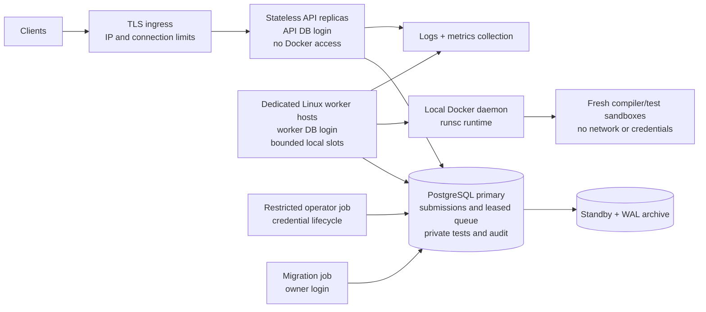

# Production architecture

## Deployment and trust boundaries

API replicas share request budgets and admission limits in PostgreSQL. Workers may
scale across hosts with independent Docker daemons; `SKIP LOCKED` distributes jobs.
No host-shared writable compiler directory and no cross-host artifact store are
needed: artifacts exist only for one attempt, and a recovered attempt recompiles.

Keep API, database, and execution hosts in different security groups. Workers need
TLS access to PostgreSQL and a local Unix Docker socket. Contestant containers need
neither. The worker orchestrator's Docker access is effectively host-root authority;
dedicated disposable worker hosts limit the consequences of an orchestrator/runtime
escape. Do not colocate control-plane secrets or unrelated workloads on worker hosts.

Production requires a patched Linux kernel, cgroup limits, Docker's default seccomp
profile, and an installed `runsc` runtime. A runtime preflight rejects missing runtime,
memory limits, or PID limits. The local Compose override uses `runc` for a demo and
has a weaker isolation boundary. VM/microVM isolation can replace the `sandbox.Runner`
implementation when the threat model requires a hardware boundary.

## Durable protocol

1. Authenticate, validate bounded source, and require a principal-scoped idempotency key.
2. In one transaction, lock admission, find a matching prior request, verify the
   immutable problem, enforce global and 50-per-principal backlog caps, then insert.
3. Claim the oldest eligible job under `FOR UPDATE SKIP LOCKED`; increment the attempt,
   assign a random lease token, and set expiry using the database clock.
4. Compile once and run tests sequentially in fresh containers. Renew the lease every
   one-third of its duration. A failed renewal cancels execution.
5. Publish only if state is running, the token still matches, and the lease is unexpired.
   Infrastructure failures requeue with exponential delay. After the attempt budget,
   finish with `system_error`. Expired final attempts are swept during claims.

Execution is **at least once**; publication is fenced. There is no exactly-once process
execution promise across crashes. Sandboxes have no permitted external side effects.
Idempotency replays current state, not an old cached HTTP response. Idempotency keys
remain reserved for as long as the submission row is retained.

| Failure | Behavior |
| --- | --- |
| API dies before commit | Nothing accepted; client retries with same key |
| API dies after commit/before response | Retry returns the existing job |
| Worker dies during compile/run | Lease expires; another attempt recompiles |
| Worker loses DB connectivity | Renewal fails, sandbox is canceled; stale writes are fenced |
| Old worker finishes after recovery | Token mismatch rejects its result |
| Docker fails | Retry within attempt budget, then system error |
| Last attempt dies | Claim sweep marks its expired job system error |
| No workers | API may admit until capacity; queue age/live-worker alerts fire |
| Worker is SIGTERM'd | Stop claims, cancel jobs, clean containers, requeue owned jobs |
| Worker is SIGKILL'd | Containers reaped after timeout + 60s; workspaces after 32m |
| PostgreSQL fails over | In-flight transactions may abort; idempotent clients retry |

## Isolation and data boundaries

Compilation: 45s wall deadline, 512 MiB RAM/tmpfs, 64 processes, one CPU, 16 KiB
diagnostics, 32 MiB executable. Compiler output streams through a bounded tar reader;
only one regular file is extracted to a fixed host destination. Source and artifacts
are mounted read-only. Per-test RAM/time/output limits come from the problem.

Each test has fresh tmpfs and no network, so earlier tests cannot mutate later tests.
Tests are delivered through stdin; expected outputs stay in the worker process.
Never mount a test directory, Docker socket, database secret, or host home into the
compiler or contestant container. Runtime stdout/stderr never enter API responses,
audit records, or application logs. An immutable image ID is recorded in results.

The API role can publish but cannot read private tests or change verdicts. The worker
role can read tests and update queue state, but cannot change problems or credentials.
Only the operator can create/revoke credentials; only the migration owner can change
schema. Trigger-written audit events contain identity, state, attempt and verdict,
without source, tests, or token hashes. Runtime roles cannot rewrite the audit table.
Ship audit events to independent storage for protection against a database-owner compromise.

## Capacity, fairness, and admission

The initial 10 requests/s figure is a **burst planning assumption**, not measured
execution throughput. Sustainable throughput is approximately `slots / mean job seconds`.
Measure by language and test count; Go cold compilation can dominate. At two slots
and 10s mean execution, service capacity is only 0.2 jobs/s. A queue absorbs bursts,
not sustained overload. Keep utilization below roughly 70% as an initial operating
target and measure p95/p99 wait times before choosing actual SLOs.

Reserve at least 512 MiB plus runtime/host headroom per active compiler, plus memory
for the worker process, Docker, kernel, and page cache. API concurrency is capped at
16; large problem publication at one per replica. Body, source, test-count, page,
queue, output, attempt, and deadline limits are all bounded. Apply connection/IP
limits at ingress, including before authentication; the API's principal limits do
not replace network-edge protections. Fixed-minute budgets permit boundary bursts.

Scheduling is FIFO among ready jobs, not fair-share scheduling by principal. The
per-principal backlog cap bounds monopolization, but stronger per-tenant scheduling,
separate premium queues, or contest-specific reservations would require another
policy. Do not advertise fairness or Codeforces timing parity from this v1.

## Explicit limits

- `time_ms` measures wall time including Docker startup/attach, not CPU time. Resource
  verdicts must be calibrated per production runtime and hardware. Kernel-reported
  OOM maps to memory limit; an application that handles allocation failure may exit
  with a runtime error. Long test sets can exhaust the whole-job deadline and end in
  system error on that attempt, preserving completed-test counts. Infrastructure
  failures and worker shutdown still retry; whole-job budget exhaustion does not.
- No custom checkers, scoring subtasks, interactive tasks, contest scheduling, rating,
  user registration, live output, automatic rejudging, or source-download endpoint.
- A PostgreSQL primary remains the durable coordination dependency. Standby promotion,
  PITR, ingress, gVisor installation, image scanning/signing, and secret distribution
  are deployment responsibilities, not automatic services shipped by this repo.
- The database queue is deliberately simple. Reconsider it only after claim latency,
  index growth, or I/O is a measured bottleneck; switching brokers does not increase
  compiler capacity or make execution exactly once.
